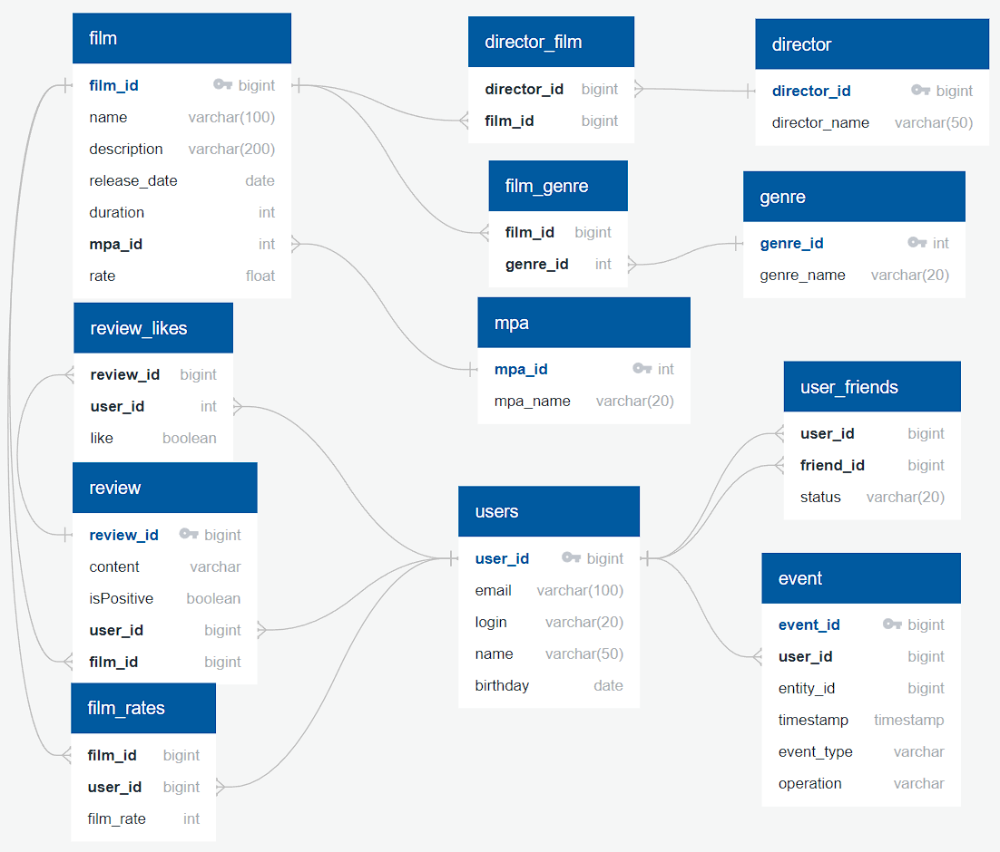

# Filmorate API

Filmorate is a social network API that helps users choose movies based on what movies their friends watch and the ratings they give.

## Features

The Filmorate API provides the following features:

### Films

- Create a film
- Update a film
- Get a film by ID
- Like a film
- Unlike a film
- Get popular films
- Delete a film
- Rate a film
- Remove a film rating
- Get a list of films by director
- Search for films
- Get common favorite films between a user and their friend

### Users

- Add a user
- Update a user
- Get all users
- Get a user by ID
- Add a user as a friend
- Remove a user from friends
- Get a user's friends
- Get mutual friends between a user and another user
- Delete a user
- Get events feed for a specific user
- Get recommendations for a user

### Genres

- Get all genres
- Get a genre by ID

### Rating

- Get an age rating by ID
- Get all age ratings

### Director

- Add a director
- Get a director by ID
- Update a director
- Delete a director
- Get all directors

### Review

- Get helpful reviews
- Get a review by ID
- Add a review
- Update a review
- Delete a review
- Like a review
- Unlike a review

## Interface

The API interface is built using Thymeleaf.

## Testing

The functionality has been tested using JUnit 5 in the `test` package.

## Installation

To use this API, follow these steps:

1. Clone the repository: `git clone https://github.com/DevSMike/java-filmorate-group.git`
2. Navigate to the project directory: `cd filmorate-api`
3. Compile the Java source files: `javac *.java`


## ER - diagram of the Filmorate project database:



## Exemplary SQL Queries

### Films

Get All Films:  
```sql 
SELECT * FROM film;
```
Get Top Films:  
```sql
SELECT film_id FROM film_likes  
GROUP BY film_id  
ORDER BY COUNT(user_id);
```

Get Film By Id:  
```sql
SELECT * FROM film  
WHERE film_id={id};
```

### Users

Get All Users:
```sql
SELECT * FROM user;
```

Get Friends List For User:  
```sql
SELECT friend_id FROM user_friends  
WHERE user_id={id};
```

Get Common Friends List:
```sql
SELECT friend_id FROM user_friends  
WHERE user_id={id1}  
AND friend_id IN (SELECT friend_id FROM user_friends
                    WHERE user_id={id2});
```

Get User By Id
```sql
SELECT * FROM user  
WHERE user_id={id};
```

## Development Stack

The project is developed using the following technologies:

- Java 11
- Spring Boot
- JDBC
- Maven
- Lambok
- JUnit
- PostgreSQL

## Contributing

Contributions to this project are welcome. To contribute, follow these steps:

1. Fork the repository.
2. Create a new branch: `git checkout -b my-branch`
3. Make your changes and commit them: `git commit -m 'Add some feature'`
4. Push to the branch: `git push origin my-branch`
5. Submit a pull request.
